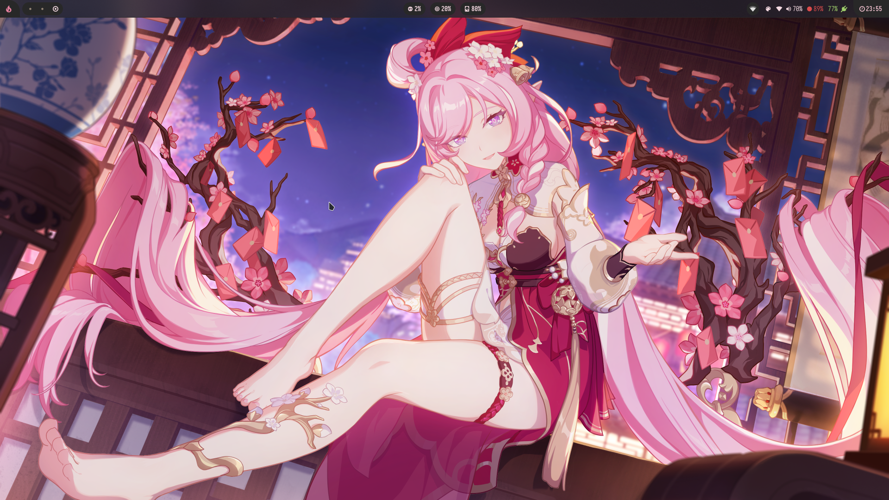
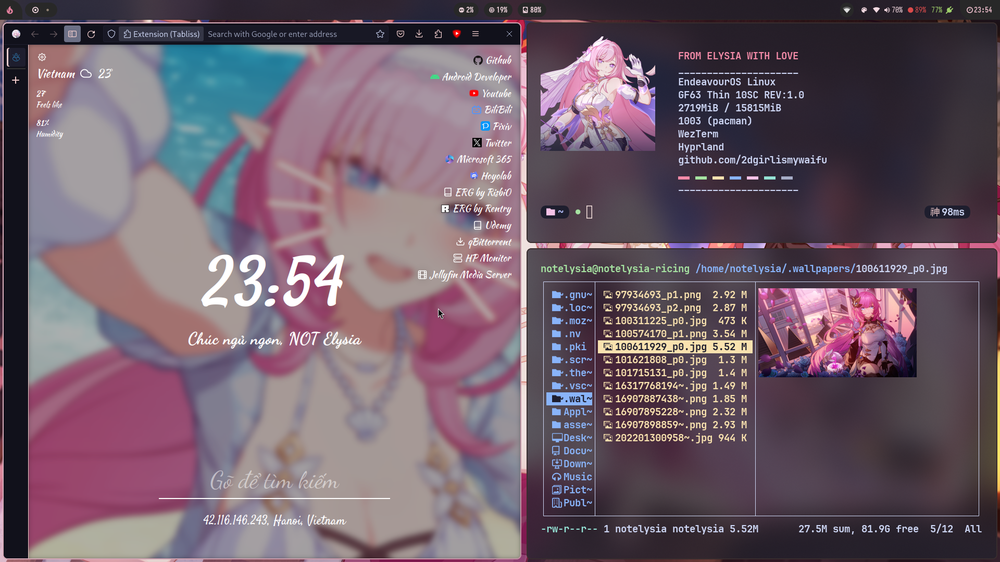
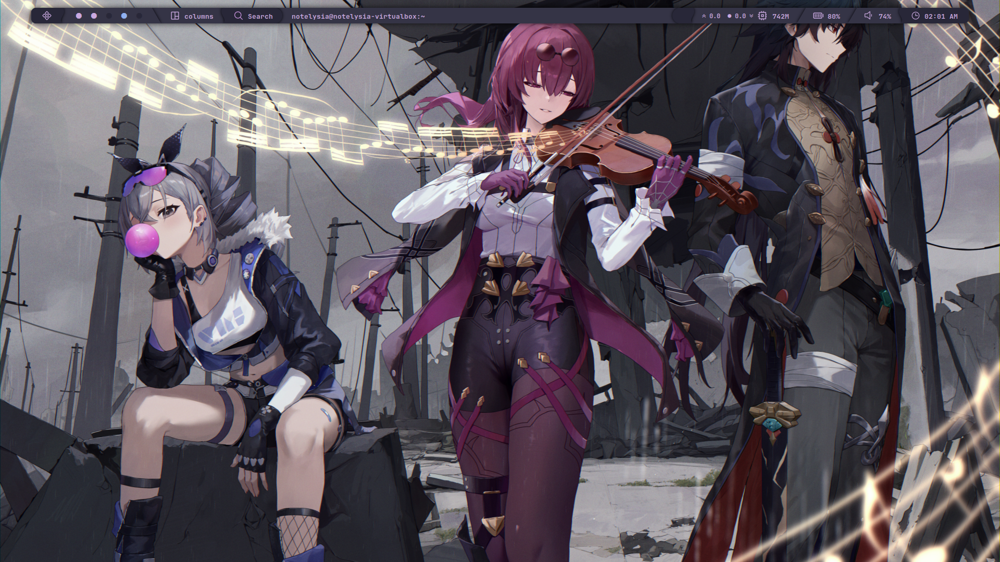
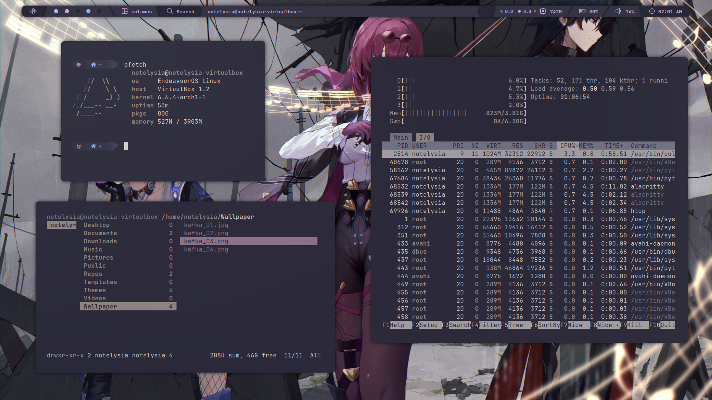
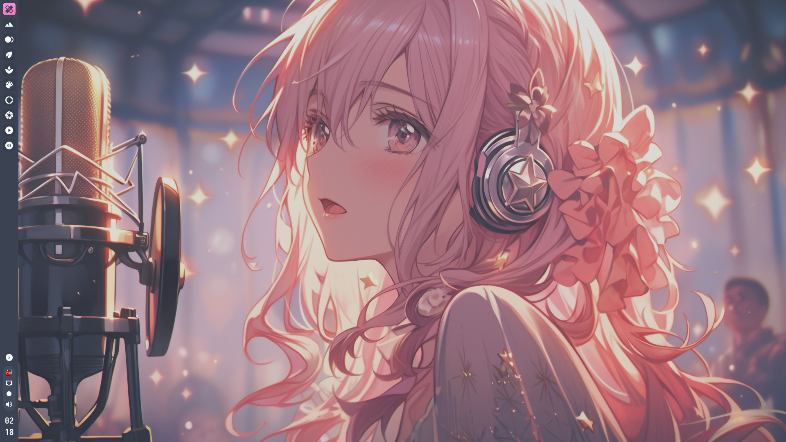
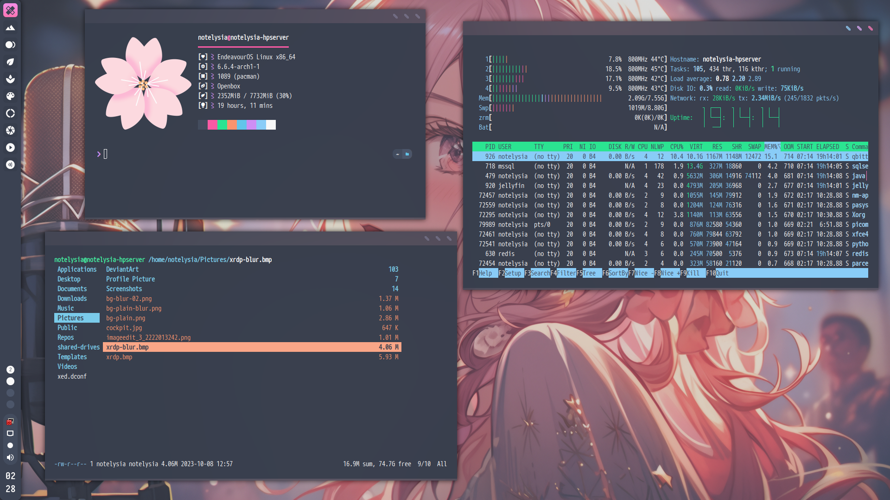

  

<h3 align="center", style="font-size:25px">My Linux Ricing Collection</h3>
  
   
  <a href="https://wiki.archlinux.org/title/Arch_Linux", style="font-size:20px"><strong>Long Live With Arch Linux</strong></a>

![Contributors][contributors-shield]
  [![Stargazers][stars-shield]][stars-url]
  ![Reposize][size-shield]
  ![Lastcommit][commit-shield]
  [![Issues][issues-shield]][issues-url]
  [![APACHE License][license-shield]][license-url]

- **Daily Device** • MSI GF63 Thin 10SC
- **CPU** • Intel® Core™ i5-10500H
- **Integrated GPU** • Intel® UHD Graphics for 10th
- **Discrete GPU** • NVIDIA GeForce GTX 1650 Max-Q Design
- **Memory** • 16GB SODIM-DDR4
- **Display** • 15.6" FHD (1920x1080), IPS-Level 144Hz 45% NTSC Thin Bezel
- **Main OS** • Windows 11 Pro
- **Second OS** • EndeavourOS (based on Arch Linux)
  customizable!
- **Hackintosh** • [My-OpenCore Hackintosh](https://github.com/2dgirlismywaifu/My-Opencore-Hackintosh)

## 🌸 [Hyprland](https://github.com/2dgirlismywaifu/My-Linux-Ricing/tree/hyprland)

## 🌸 [Qtile](https://github.com/2dgirlismywaifu/My-Linux-Ricing/tree/qtile)

## 🌸 [Openbox](https://github.com/2dgirlismywaifu/My-Linux-Ricing/tree/openbox)

## Credits

  

    
    
    
  

_Beauty community: [r/unixporn](https://www.reddit.com/r/unixporn)._

**©** Elysia, Kafka is a character design by Hoyoverse

**©** Picture used in this sources come from Pixiv and N0va Desktop

**©** Openbox theme use wallpaper from [furukawa-rikka](https://www.deviantart.com/furukawa-rikka)

<!-- MARKDOWN LINKS & IMAGES -->
<!-- https://www.markdownguide.org/basic-syntax/#reference-style-links -->
[contributors-shield]: https://img.shields.io/github/contributors/2dgirlismywaifu/My-Linux-Ricing.svg?style=for-the-badge&color=C9CBFF&logoColor=D9E0EE&labelColor=302D41
[contributors-url]: https://github.com/2dgirlismywaifu/My-Linux-Ricing/graphs/contributors
[forks-shield]: https://img.shields.io/github/forks/2dgirlismywaifu/My-Linux-Ricing.svg?style=for-the-badge&color=C9CBFF&logoColor=D9E0EE&labelColor=302D41
[forks-url]: https://github.com/2dgirlismywaifu/My-Linux-Ricing/network/members
[stars-shield]: https://img.shields.io/github/stars/2dgirlismywaifu/My-Linux-Ricing.svg?style=for-the-badge&color=C9CBFF&logoColor=D9E0EE&labelColor=302D41
[size-shield]: https://img.shields.io/github/repo-size/2dgirlismywaifu/My-Linux-Ricing.svg?style=for-the-badge&color=C9CBFF&logoColor=D9E0EE&labelColor=302D41
[linecount-shield]: https://img.shields.io/tokei/lines/github/2dgirlismywaifu/My-Linux-Ricing?color=C9CBFF&labelColor=302D41&style=for-the-badge
[commit-shield]: https://img.shields.io/github/last-commit/2dgirlismywaifu/My-Linux-Ricing.svg?style=for-the-badge&color=C9CBFF&logoColor=D9E0EE&labelColor=302D41
[stars-url]: https://github.com/2dgirlismywaifu/My-Linux-Ricing/stargazers
[issues-shield]: https://img.shields.io/github/issues/2dgirlismywaifu/My-Linux-Ricing.svg?style=for-the-badge&color=C9CBFF&logoColor=D9E0EE&labelColor=302D41
[issues-url]: https://github.com/2dgirlismywaifu/My-Linux-Ricing/issues
[license-shield]: https://img.shields.io/github/license/2dgirlismywaifu/My-Linux-Ricing.svg?style=for-the-badge&color=C9CBFF&logoColor=D9E0EE&labelColor=302D41
[license-url]: https://github.com/2dgirlismywaifu/My-Linux-Ricing/blob/main/LICENSE
