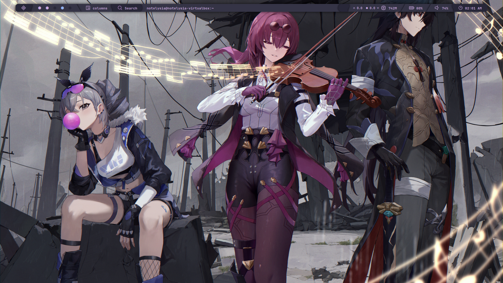
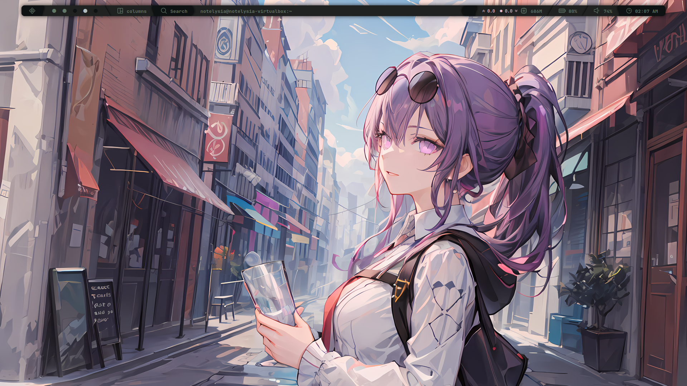
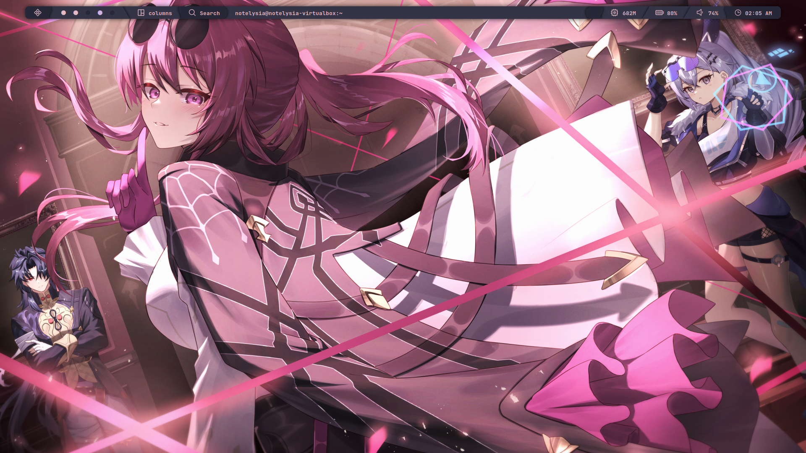
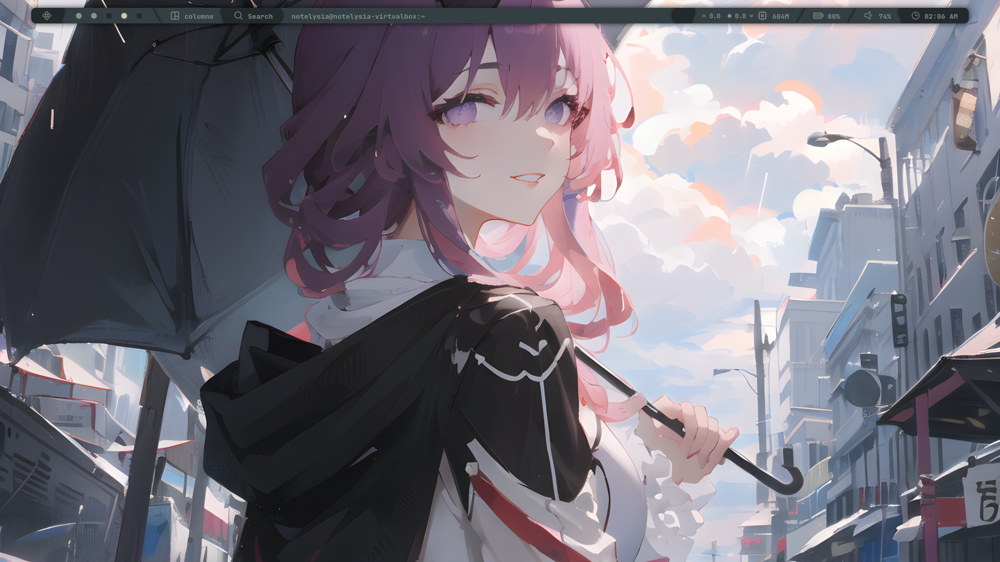
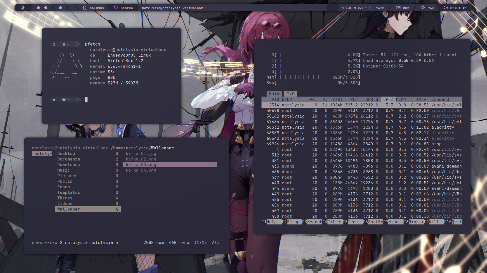
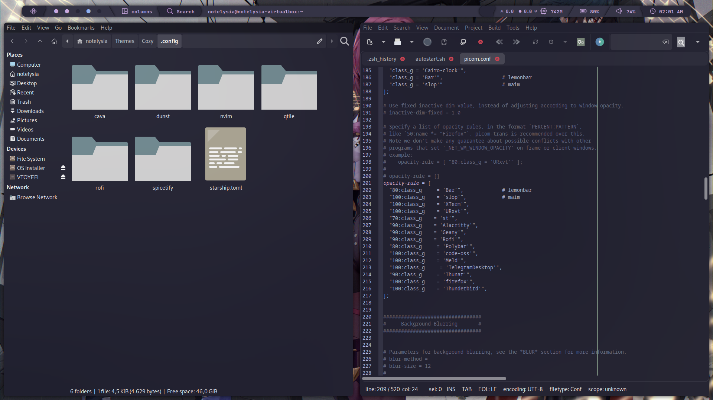
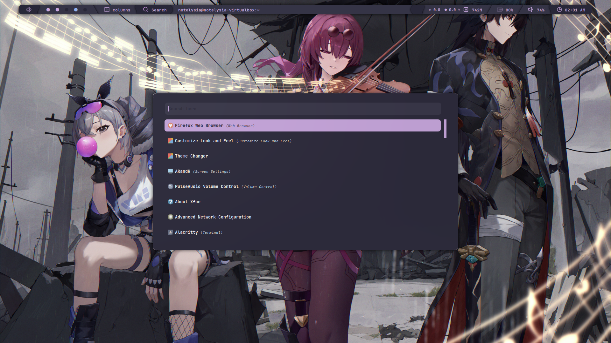
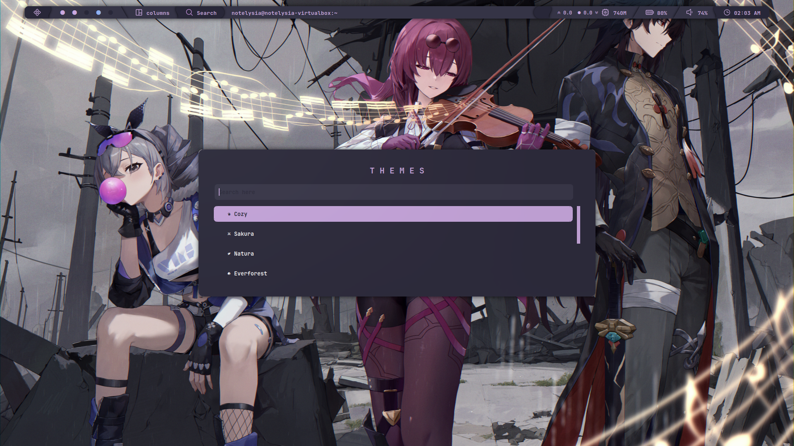

<div align="center">
  <a href="https://github.com/2dgirlismywaifu/My-Linux-Ricing/tree/qtile">
    
  </a>

<h3 align="center", style="font-size:25px">My Qtile Linux Ricing</h3>
  <a href="https://git.io/typing-svg"></a>
  <br />
  <a href="https://github.com/Darkkal44/Cozytile", style="font-size:20px"><strong>Inspired from @Darkkal44 Ricing</strong></a>
<hr>


</div>


- **Window Manager** • [Qtile](https://github.com/qtile/qtile)🎨 Window Tiles
  Powered by Python!
- **Shell** • [Zsh](https://www.zsh.org) 🐚 theme with
  [starship](https://github.com/starship/starship) Cross Shell Platform!
- **Terminal** • [Alacritty](https://github.com/alacritty/alacritty) 💻 A cross-platform, OpenGL terminal emulator!
- **Panel** • [Qtile Pane](https://github.com/qtile/qtile)🍧
  Include with Qtile!
- **Notify Daemon** • [Dunst](https://github.com/dunst-project/dunst) 🍃
  Minimalist and functional!
- **Launcher** • [Rofi](https://github.com/davatorium/rofi) 🚀 Beautiful list launcher
  customizable!
- **File Manager** • [Ranger](https://github.com/ranger/ranger)🔖 Based Catppuccin theme!


## 🌸 Setup



## Install steps (Take care about it. This is RTFM)
<div align="left">

### Qtile Stuff

<details>

###### To get started, let's make sure we have all the necessary prerequisites. In this case, I'm using Yay as the AUR helper, you can use any other helper like Paru or install the packages manually.

- Installation using yay

```sh
yay -S qtile dunst nwg-look rofi python-psutil pywal-git feh picom dunst zsh starship playerctl brightnessctl alacritty thunar rofi ranger cava pulseaudio alsa-utils neovim vim git sddm-git
```
</details>

### Dependencies
<details>

- Installation using yay

```sh
yay -S tumbler fnm ffmpegthumbnailer gnome-keyring grimblast-git qt5-quickcontrols qt5-quickcontrols2 qt5-graphicaleffects qt5-wayland qt6-wayland nerd-fonts ttf-jetbrains-mono ttf-iosevka ttf-iosevka-nerd qt5-imageformats qt5ct
```

</details>

### Apps & More
<details>

#### CLI & Tools
```sh
yay -S htop pfetch rofi-emoji starship zsh viewnior flameshot-git
```
#### Browser & File Explorer

```sh
yay -S firefox file-roller noto-fonts noto-fonts-cjk noto-fonts-emoji ranger thunar thunar-archive-plugin thunar-volman alacritty
```
#### Editor

```sh
yay -S visual-studio-code-bin geany neovim vim
```
#### Theme Based

```sh
yay -S catppuccin-gtk-theme-macchiato catppuccin-gtk-theme-mocha papirus-icon-theme kvantum kvantum-theme-catppuccin-git
```
#### Audio

```sh
yay -S pulseaudio-alsa pulseaudio-jack pulseaudio-bluetooth jack2 pulseaudio-alsa pulseaudio-jack pamixer pavucontrol
```
#### Zsh

```sh
chsh -s $(which zsh)
sh -c "$(curl -fsSL https://raw.githubusercontent.com/ohmyzsh/ohmyzsh/master/tools/install.sh)"
git clone https://github.com/zsh-users/zsh-autosuggestions ${ZSH_CUSTOM:-~/.oh-my-zsh/custom}/plugins/zsh-autosuggestions
git clone https://github.com/zsh-users/zsh-syntax-highlighting.git ${ZSH_CUSTOM:-~/.oh-my-zsh/custom}/plugins/zsh-syntax-highlighting
```

</details>

</div>

<div align="left">

### DOTFILES

<details>


###### Now, let's clone the repository and copy the files to the home directory.

```sh
git clone --branch qtile https://github.com/2dgirlismywaifu/My-Linux-Ricing.git
cd My-Linux-Ricing
cp -R ./. ~/
```

</details>
</div>

## Credits
<div align="center">

  <p float="left">
    
    
    
  </p>
</div>

_Beauty community: [r/unixporn](https://www.reddit.com/r/unixporn)._

**©** Kafka is a character from Honkai: Star Rail (before it, she is a stigmata in Honkai Impact 3), a game by Hoyoverse (miHoYo)

**©** Picture used in this sources come from Pixiv.

**©** This repository is forked from [Darkkal44](https://github.com/Darkkal44/Cozytile) with fixing sh files permission and add missing package.

