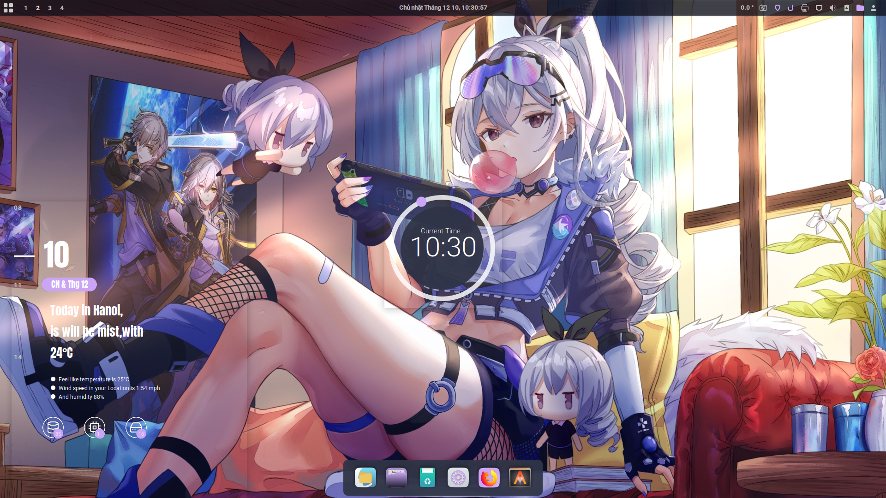
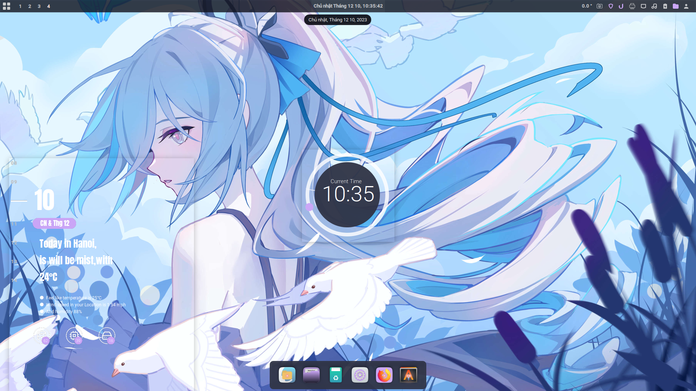
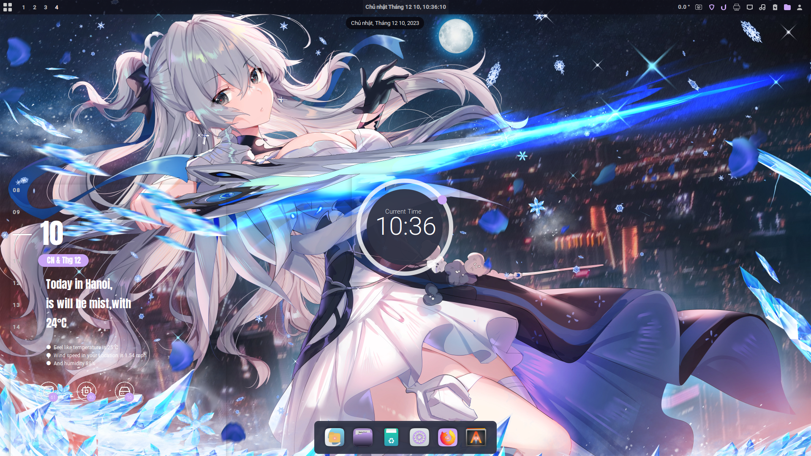
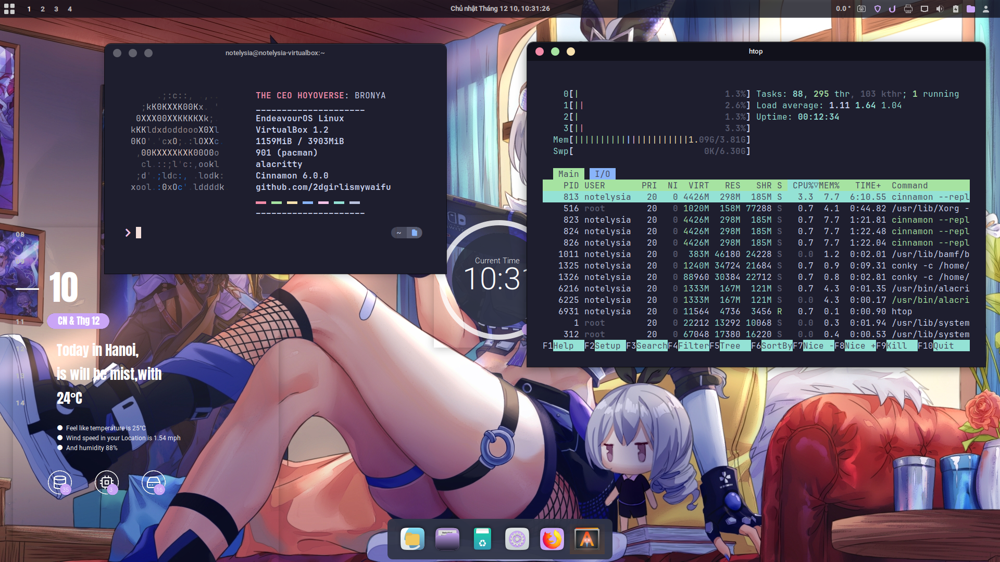
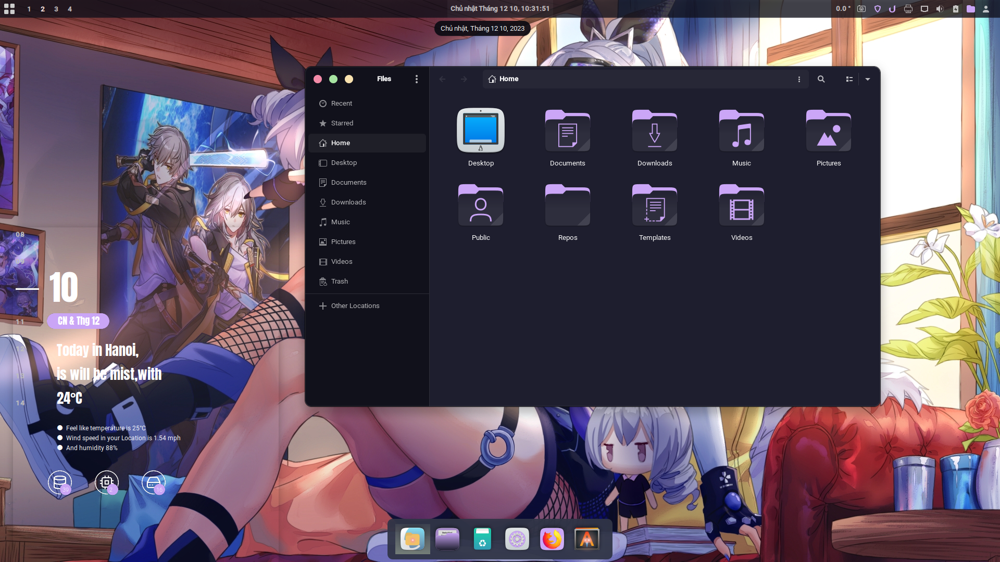
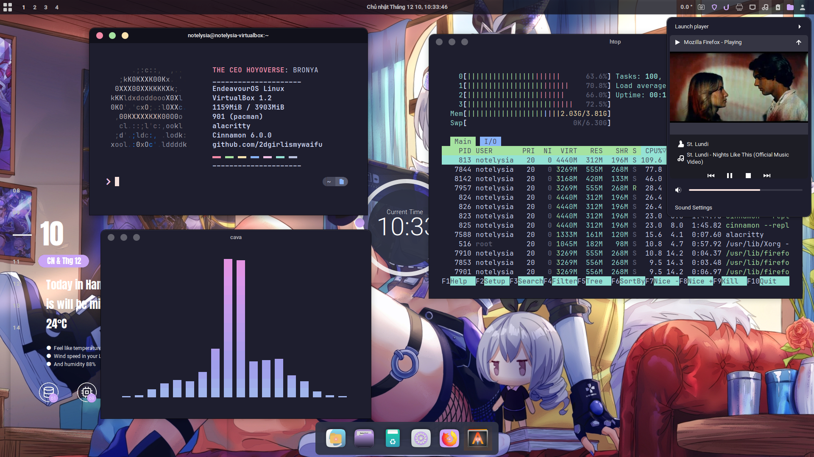

<div align="center">
  <a href="https://github.com/2dgirlismywaifu/My-Linux-Ricing">
    
  </a>

<h3 align="center", style="font-size:25px">The Cinnamon Ricing</h3>
  <a href="https://git.io/typing-svg"></a>
  <br />
  <a href="https://www.youtube.com/@linuxscoop", style="font-size:20px"><strong>Design by @LinuxScoop</strong></a>
<hr>

</div>

- **Desktop Environment** • [Cinnamon](https://github.com/hyprwm/Hyprland)🎨 Window Tiles
  Everywhere!
- **Shell** • [Zsh](https://www.zsh.org) 🐚 theme with
  [oh-my-zsh](https://github.com/ohmyzsh/ohmyzsh) Custom designed!
- **Terminal** • [Alacritty](https://github.com/alacritty/alacritty) 💻 A cross-platform, OpenGL terminal emulator!
  with gpu support!
- **Panel** • Cinnamon Panel🍧
  Patched waybar following hyprland faq!
- **File Manager** • [Nautilus](https://apps.gnome.org/en/Nautilus)🔖 Based Catppuccin theme!

## 🌸 Setup

    

## Install steps (This setup very easy to install)
<div align="left">

### Linux Scoop Installation Instruction

<details>

- Follow the instruction in this [documents](./Instrustion-Linuxscoop.html)

</details>

### Additional Installation
<details>

#### CLI & Tools
```sh
yay -S htop zsh cava neofetch alacritty
```

#### Editor

```sh
yay -S visual-studio-code-bin geany neovim vim
```
#### Theme Based

 - If you use Arch Linux, you can install the theme from the AUR repository. If you use another distro, you can install it from the source code.

```sh
yay -S catppuccin-gtk-theme-macchiato catppuccin-gtk-theme-mocha papirus-icon-theme kvantum kvantum-theme-catppuccin-git
```
#### Zsh

```sh
chsh -s $(which zsh)
sh -c "$(curl -fsSL https://raw.githubusercontent.com/ohmyzsh/ohmyzsh/master/tools/install.sh)"
git clone https://github.com/zsh-users/zsh-autosuggestions ${ZSH_CUSTOM:-~/.oh-my-zsh/custom}/plugins/zsh-autosuggestions
git clone https://github.com/zsh-users/zsh-syntax-highlighting.git ${ZSH_CUSTOM:-~/.oh-my-zsh/custom}/plugins/zsh-syntax-highlighting
```
#### Fonts
- The nerd fonts: choose JetBrainsMono, Iosevka
```sh
yay -S nerd-fonts ttf-iosevka
```
#### Dotfiles

- Just copy the dotfiles to your home directory
```sh
 cp -r .config ~/
 cp .zshrc ~/
 cp .oh-my-zsh ~/
```

</details>

</div>


## Credits
<div align="center">

  <p float="left">
    
    
    
  </p>
</div>

_Beauty community: [r/unixporn](https://www.reddit.com/r/unixporn)._

**©** Bronya is a character playable from Houkai Gakuen, Honkai Impact 3 and Honkai: Star Rail. Design by Hoyoverse

**©** Picture used in this sources come from Pixiv and N0va Desktop

**©** The sticker used in top page this document come from [Marin Liekuriva](https://twitter.com/MarinLiekuriva). You can buy it in [Ko-Fi](https://ko-fi.com/marinliekuriva)

**©** The Cinnamon desktop environment ricing by [LinuxScoop](https://www.youtube.com/@linuxscoop). If you like this ricing, you can support him at [Ko-Fi](https://ko-fi.com/linuxscoop)

