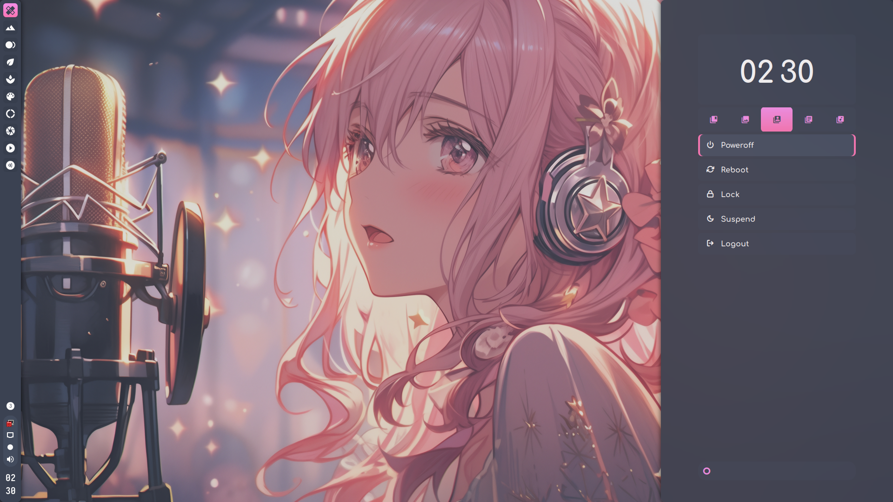

<div align="center">
  <a href="https://github.com/2dgirlismywaifu/My-Linux-Ricing">
    
  </a>

<h3 align="center", style="font-size:25px">My Openbox Linux Ricing</h3>
  <a href="https://git.io/typing-svg"></a>
  <br />
  <a href="https://github.com/owl4ce/dotfiles", style="font-size:20px"><strong>Inspired from @owl4ce Ricing</strong></a>
<hr>

</div>

- **Window Manager** :bento: [Openbox](http://openbox.org/wiki/Main_Page) dual themes!
- **Openbox Menu** :cyclone: [obmenu-generator](https://github.com/trizen/obmenu-generator) for life!
- **Panel** :blossom: [Tint2](https://gitlab.com/o9000/tint2) with material design and glyphs!
- **Application Launcher** :rocket: [Rofi](https://github.com/davatorium/rofi) which blazing fast!
- **Desktop Notification** :herb: [Dunst](https://github.com/dunst-project/dunst) which minimalist!
- **Terminal Emulator** :leaves: [URxvt](http://software.schmorp.de/pkg/rxvt-unicode.html) which lightest!
- **Shell** :shell: [Zsh](https://zsh.org) with [oh-my-zsh](https://github.com/ohmyzsh/ohmyzsh) framework!
- **Compositor** :shaved_ice: [Picom](https://github.com/yshui/picom) for perfection topping!
- **File Manager** :flower_playing_cards: [Thunar](https://docs.xfce.org/xfce/thunar/start) customized side-pane!
- **Media Player** :city_sunset: [mpv](https://mpv.io) with modern OSC!
- **Music Player** :milky_way: [Ncmpcpp](https://github.com/ncmpcpp/ncmpcpp) with album-art!
- **GUI (Basic) IDE** :space_invader: [Geany](https://geany.org) for the win!


## 🌸 Setup

      

## 🌸 Install steps (Take care about it. This is RTFM)
<div align="left">

### Dependencies

<details>

###### To get started, let's make sure we have all the necessary prerequisites. In this case, I'm using Yay as the AUR helper, you can use any other helper like Paru or install the packages manually.

- X.Org server and utilities. This is essentials.

```sh
yay -S xorg-server xorg-xrandr xorg-xrdb psmisc
```

- The UI kits and functionality

```sh
yay -S dunst nitrogen openbox rofi rxvt-unicode-truecolor-wide-glyphs tint2 picom obmenu-generator perl-gtk3 rxvt-unicode-truecolor-wide-glyphs
obmenu-generator
```

- Audio-server and audio stuff.

```sh
yay -S pulseaudio pulseaudio-alsa mpd mpc ncmpcpp
```

- Extended utilities. Required, but just as necessary.

```sh
yay -S alsa-utils brightnessctl imagemagick scrot w3m wireless_tools xclip xsettingsd xss-lock
```

- Additionals for completion of desktop compositions.

```sh
yay -S thunar thunar-archive-plugin thunar-volman ffmpegthumbnailer tumbler geany geany-plugins gimp gsimplecal inkscape mpv parcellite pavucontrol viewnior xfce4-power-manager htop nano neofetch
```
- Additionally Z shell with oh-my-zsh plugins

```sh
sh -c "$(curl -fsSL https://raw.githubusercontent.com/ohmyzsh/ohmyzsh/master/tools/install.sh)"
```
```sh
sudo chsh -s $(command -v zsh)
```
```sh
git clone --depth 1 https://github.com/zdharma-continuum/fast-syntax-highlighting.git ${ZSH_CUSTOM:-~/.oh-my-zsh/custom}/plugins/fast-syntax-highlighting
```sh
git clone --depth 1 https://github.com/zsh-users/zsh-autosuggestions.git ${ZSH_CUSTOM:-~/.oh-my-zsh/custom}/plugins/zsh-autosuggestions
``````
```sh
git clone --depth 1 https://github.com/zsh-users/zsh-completions.git ${ZSH_CUSTOM:-~/.oh-my-zsh/custom}/plugins/zsh-completions
```
</details>

### Preqequisites

<details>

- Clone this repository

```sh
git clone --branch openbox https://github.com/2dgirlismywaifu/My-Linux-Ricing.git

cd My-Linux-Ricing
```
- Now copy the fonts to the directory

```sh
cd Extra_JOYFUL
cp -R .fonts/ ~/
fc-cache -rv
```

- Create a directory for the icons

```sh
mkdir -pv ~/.icons
```
- Copy the icons to the directory

```sh
cd Extra_JOYFUL/.icons
tar -xf Gladient_JfD.tar.xz -C ~/.icons/
tar -xf Papirus-Custom.tar.xz -C ~/.icons/
tar -xf Papirus-Dark-Custom.tar.xz -C ~/.icons/
```

- Link the icons to the system

```sh
sudo ln -vs ~/.icons/Papirus-Custom /usr/share/icons/
sudo ln -vs ~/.icons/Papirus-Dark-Custom /usr/share/icons/
```
- Create a directory for the wallpapers

```sh
mkdir -pv ~/.wallpapers
```

- Copy the wallpapers to the directory

```sh
cd Extra_JOYFUL/.wallpapers
cp -R ./* ~/.wallpapers/
```

- Extension for URxvt

```sh
mkdir -pv ~/.urxvt/ext
(cd ~/.urxvt/ext/; curl -LO https://raw.githubusercontent.com/simmel/urxvt-resize-font/master/resize-font)
(cd ~/.urxvt/ext/; curl -LO https://raw.githubusercontent.com/mina86/urxvt-tabbedex/master/tabbedex)
```
</details>

### DOTFILES

<details>

- Copy the main configuration files first

```sh
cd My-Linux-Ricing
rsync -avxHAXP --exclude-from=- dotfiles/. ~/ << "EXCLUDE"
.git*
LICENSE
*.md
EXTRA_JOYFUL
EXCLUDE
```
- Copy the second configuration files

```sh
rsync -avxHAXP --exclude-from=- dotfiles/EXTRA_JOYFUL/. ~/ << "EXCLUDE"
.fonts
.wallpapers
.icons
.git*
neofetch
EXCLUDE
```
</details>
</div>

## 🌸 Keybinding

<details>
<summary><b>Openbox (<a href="https://github.com/2dgirlismywaifu/My-Linux-Ricing/blob/openbox/.config/openbox/rc.xml#L175-L827">rc.xml</a>)</b></summary>

| Key                                                                                                                                                         | Action                                            |
|:------------------------------------------------------------------------------------------------------------------------------------------------------------|:--------------------------------------------------|
|                                                                                                                                                             |                                                   |
| **Window Management and more**                                                                                                                              |                                                   |
| <kbd>super</kbd> + <kbd>⯇</kbd>                                                                                                                            | Move window focus to left-side                    |
| <kbd>super</kbd> + <kbd>⯈</kbd>                                                                                                                            | Move window focus to right-side                   |
| <kbd>super</kbd> + <kbd>⯅</kbd>                                                                                                                            | Move window focus to up-side                      |
| <kbd>super</kbd> + <kbd>⯆</kbd>                                                                                                                            | Move window focus to down-side                    |
| <kbd>super</kbd> + <kbd>shift</kbd> + <kbd>⯇</kbd>                                                                                                         | Move focused window to left-side                  |
| <kbd>super</kbd> + <kbd>shift</kbd> + <kbd>⯈</kbd>                                                                                                         | Move focused window to right-side                 |
| <kbd>super</kbd> + <kbd>shift</kbd> + <kbd>⯅</kbd>                                                                                                         | Move focused window to up-side                    |
| <kbd>super</kbd> + <kbd>shift</kbd> + <kbd>⯆</kbd>                                                                                                         | Move focused window to down-side                  |
| <kbd>super</kbd> + <kbd>1</kbd> / <kbd>2</kbd> / <kbd>3</kbd> / <kbd>4</kbd> / <kbd>5</kbd> / <kbd>6</kbd> / <kbd>7</kbd> / <kbd>8</kbd>                    | Move to N desktop/workspace                       |
| <kbd>super</kbd> + <kbd>shift</kbd> + <kbd>1</kbd> / <kbd>2</kbd> / <kbd>3</kbd> / <kbd>4</kbd> / <kbd>5</kbd> / <kbd>6</kbd> / <kbd>7</kbd> / <kbd>8</kbd> | Move focused window to N desktop/workspace        |
| <kbd>alt</kbd> + <kbd>ㅤㅤㅤㅤ</kbd>                                                                                                                         | Show (client-)menu of focused window              |
| <kbd>super</kbd> + <kbd>C</kbd>                                                                                                                             | Close/kill focused window                         |
| <kbd>super</kbd> + <kbd>D</kbd>                                                                                                                             | Toggle show desktop                               |
| <kbd>super</kbd> + <kbd>F</kbd>                                                                                                                             | Toggle fullscreen for focused window              |
| <kbd>super</kbd> + <kbd>ㅤㅤㅤㅤ</kbd>                                                                                                                       | Show desktop (root-)menu                          |
| <kbd>super</kbd> + <kbd>T</kbd>                                                                                                                             | Toggle decorations of focused window              |
| <kbd>super</kbd> + <kbd>X</kbd>                                                                                                                             | Toggle maximize for focused window                |
| <kbd>super</kbd> + <kbd>Z</kbd>                                                                                                                             | Toggle iconify (or minimize) for focused window   |
| <kbd>alt</kbd> + <kbd>tab</kbd>                                                                                                                             | Switch active window to next window               |
| <kbd>alt</kbd> + <kbd>shift</kbd> + <kbd>tab</kbd>                                                                                                          | Switch active window to previous window           |
| <kbd>super</kbd> + <kbd>esc</kbd>                                                                                                                           | Open rofi extensions menu                         |
| <kbd>super</kbd> + <kbd>prt sc</kbd>                                                                                                                        | Open rofi screenshots menu                        |
| <kbd>super</kbd> + <kbd>R</kbd>                                                                                                                             | Open rofi main menu                               |
| <kbd>prt sc</kbd>                                                                                                                                           | Screenshot                                        |
| <kbd>ctrl</kbd> + <kbd>prt sc</kbd>                                                                                                                         | Countdown screenshot                              |
| <kbd>shift</kbd> + <kbd>prt sc</kbd>                                                                                                                        | Selection screenshot                              |
| <kbd>ctrl</kbd> + <kbd>esc</kbd>                                                                                                                            | Pop-up notification history                       |
| <kbd>ctrl</kbd> + <kbd>enter</kbd>                                                                                                                          | Open current notification context-menu            |
| <kbd>ctrl</kbd> + <kbd>ㅤㅤㅤㅤ</kbd>                                                                                                                        | Close current notification                        |
| <kbd>ctrl</kbd> + <kbd>shift</kbd> + <kbd>ㅤㅤㅤㅤ</kbd>                                                                                                     | Close all notifications                           |
| <kbd>super</kbd> + <kbd>E</kbd>                                                                                                                             | Open user's preferred file manager                |
| <kbd>super</kbd> + <kbd>L</kbd>                                                                                                                             | Lock current session with user's preferred locker |
| <kbd>super</kbd> + <kbd>enter</kbd>                                                                                                                         | Open user's preferred terminal emulator           |
| <kbd>super</kbd> + <kbd>shift</kbd> + <kbd>enter</kbd>                                                                                                      | Reverse terminal emulator background-foreground   |
| <kbd>super</kbd> + <kbd>shift</kbd> + <kbd>R</kbd>                                                                                                          | Restart UI                                        |
|                                                                                                                                                             |                                                   |
| **Brightness Control**                                                                                                                                      |                                                   |
| <kbd>🔆+</kbd>                                                                                                                                              | Increase brightness by N%                         |
| <kbd>🔆-</kbd>                                                                                                                                              | Decrease brightness by N%                         |
|                                                                                                                                                             |                                                   |
| **Audio-volume Control**                                                                                                                                    |                                                   |
| <kbd>🔊+</kbd>                                                                                                                                              | Increase audio-volume by N%                       |
| <kbd>🔊-</kbd>                                                                                                                                              | Decrease audio-volume by N%                       |
| <kbd>🔇</kbd>                                                                                                                                               | Toggle mute                                       |
|                                                                                                                                                             |                                                   |
| **Media Control**                                                                                                                                           |                                                   |
| <kbd>⏮</kbd>                                                                                                                                               | Previous track                                    |
| <kbd>⏭</kbd>                                                                                                                                               | Next track                                        |
| <kbd>⏹</kbd>                                                                                                                                               | Stop playing music                                |
| <kbd>⏯</kbd>                                                                                                                                               | Toggle play/pause                                 |
|                                                                                                                                                             |                                                   |
| **Combo Keyboard and Pointing Device**                                                                                                                      |                                                   |
| <kbd>super</kbd> + <kbd>`left click`</kbd> (hold)                                                                                                           | Move focused window freely                        |
| <kbd>super</kbd> + <kbd>`right click`</kbd> (hold)                                                                                                          | Resize focused window freely                      |
| <kbd>super</kbd> + <kbd>`scroll up`</kbd> / <kbd>`scroll down`</kbd>                                                                                        | Move desktop/workspace to previous or next        |
|                                                                                                                                                             |                                                   |
| **Cursor on Desktop**                                                                                                                                       |                                                   |
| <kbd>`middle click`</kbd>                                                                                                                                   | Show desktop/workspace lists                      |
| <kbd>`right click`</kbd>                                                                                                                                    | Show desktop (root-)menu                          |
| <kbd>`scroll up`</kbd> / <kbd>`scroll down`</kbd>                                                                                                           | Move desktop/workspace to previous or next        |
|                                                                                                                                                             |                                                   |
| **Cursor on Window Titlebar**                                                                                                                               |                                                   |
| <kbd>`left click`</kbd> (or simply hover)                                                                                                                   | Focus and raise window                            |
| <kbd>`middle click`</kbd>                                                                                                                                   | Switch active window to previous or next window   |
| <kbd>`right click`</kbd>                                                                                                                                    | Show (client-)menu of focused window              |
| <kbd>`scroll up`</kbd> / <kbd>`scroll down`</kbd>                                                                                                           | Roll up or down focused window                    |

> **LEGEND**
> [<kbd>super</kbd>](https://en.wikipedia.org/wiki/Super_key_(keyboard_button))

</details>

<details>
<summary><b>Parcellite (<a href="https://github.com/2dgirlismywaifu/My-Linux-Ricing/tree/openbox/EXTRA_JOYFUL/.config/parcellite/parcelliterc#L38-L41">parcelliterc</a>)</b></summary>

| Key                                             | Action                       |
|:------------------------------------------------|:-----------------------------|
| <kbd>ctrl</kbd> + <kbd>alt</kbd> + <kbd>P</kbd> | Show menu                    |
| <kbd>ctrl</kbd> + <kbd>alt</kbd> + <kbd>H</kbd> | Show history menu            |
| <kbd>ctrl</kbd> + <kbd>alt</kbd> + <kbd>X</kbd> | Show persistent history menu |
| <kbd>ctrl</kbd> + <kbd>alt</kbd> + <kbd>A</kbd> | Show action menu             |

</details>

<details>
<summary><b>URxvt (<a href="https://github.com/2dgirlismywaifu/My-Linux-Ricing/blob/openbox/.Xresources">.Xresources</a>)</b></summary>

| Key                                                          | Action                             |
|:-------------------------------------------------------------|:-----------------------------------|
|                                                              |                                    |
| **Built-in**                                                 |                                    |
| <kbd>ctrl</kbd> + <kbd>shift</kbd> + <kbd>L</kbd>            | Clear scrollback buffer cleanly    |
| <kbd>ctrl</kbd> + <kbd>shift</kbd> + <kbd>C</kbd>            | Copy selection to clipboard        |
| <kbd>ctrl</kbd> + <kbd>shift</kbd> + <kbd>V</kbd>            | Paste clipboard                    |
| <kbd>ctrl</kbd> + <kbd>⯅</kbd>                              | Scroll up by line                  |
| <kbd>ctrl</kbd> + <kbd>⯆</kbd>                              | Scroll down by line                |
| <kbd>ctrl</kbd> + <kbd>home</kbd>                            | Scroll up to top                   |
| <kbd>ctrl</kbd> + <kbd>end</kbd>                             | Scroll down to bottom              |
| <kbd>ctrl</kbd> + <kbd>`right click`</kbd> (hold)            | Show context-menu                  |
|                                                              |                                    |
| **URL Selection (matcher)**                                  |                                    |
| <kbd>ctrl</kbd> + <kbd>shift</kbd> + <kbd>U</kbd>            | Activate URL selection             |
| <kbd>⯇</kbd> / <kbd>⯅</kbd> / <kbd>⯈</kbd> / <kbd>⯆</kbd> | Navigate URL selection             |
| <kbd>enter</kbd> / <kbd>`left click`</kbd>                   | Open selected URL                  |
| <kbd>esc</kbd>                                               | Deactivate URL selection           |
|                                                              |                                    |
| **Font Resizer**                                             |                                    |
| <kbd>ctrl</kbd> + <kbd>+</kbd>                               | Increase font size by Npx          |
| <kbd>ctrl</kbd> + <kbd>-</kbd>                               | Decrease font size by Npx          |
| <kbd>ctrl</kbd> + <kbd>=</kbd>                               | Reset font size to default         |
| <kbd>ctrl</kbd> + <kbd>?</kbd>                               | Show font information              |
|                                                              |                                    |
| **Tabbed Extended**                                          |                                    |
| <kbd>ctrl</kbd> + <kbd>shift</kbd> + <kbd>T</kbd>            | New tab                            |
| <kbd>ctrl</kbd> + <kbd>shift</kbd> + <kbd>R</kbd>            | Rename current tab                 |
| <kbd>ctrl</kbd> + <kbd>shift</kbd> + <kbd>W</kbd>            | Close/kill current tab             |
| <kbd>ctrl</kbd> + <kbd>pg up</kbd>                           | Jump to next tab                   |
| <kbd>ctrl</kbd> + <kbd>pg dn</kbd>                           | Jump to previous tab               |
| <kbd>ctrl</kbd> + <kbd>shift</kbd> + <kbd>pg up</kbd>        | Move current tab to next order     |
| <kbd>ctrl</kbd> + <kbd>shift</kbd> + <kbd>pg dn</kbd>        | Move current tab to previous order |

> **SHELL**
> Most shells use the readline([3](https://www.man7.org/linux/man-pages/man3/readline.3.html#EDITING_COMMANDS)) library.
> In addition, provided by shell plugins.
> ```sh
> 💲 man 3 readline | less +/EDITING\ COMMANDS
> ```

</details>

<details>
<summary><b>Dunst (<a href="https://github.com/2dgirlismywaifu/My-Linux-Ricing/blob/openbox/.config/dunst/mechanical.artistic.dunstrc#L44-L46">dunstrc</a>)</b></summary>

| Key                       | Action                          |
|:--------------------------|:--------------------------------|
| <kbd>`left click`</kbd>   | Close current notification      |
| <kbd>`middle click`</kbd> | Open notifications context-menu |
| <kbd>`right click`</kbd>  | Close all notifications         |

</details>

## Credits
<div align="center">

  <p float="left">
    
    
    
  </p>
</div>

_Beauty community: [r/unixporn](https://www.reddit.com/r/unixporn)._

**©** Picture used in this sources come from DeviantArt. You can find the artist: [Furukawa-Rika](https://www.deviantart.com/furukawa-rikka) and [AiAnimeArt9](https://www.deviantart.com/aianimeart9)

**©** This repository is forked from [owl4ce](https://github.com/owl4ce/dotfiles) with customized. Please give a star for owner repository if you liked it!

**©** Some settings instructions are taken from [owl4ce](https://github.com/owl4ce/dotfiles) cause it already has a good documentation.
